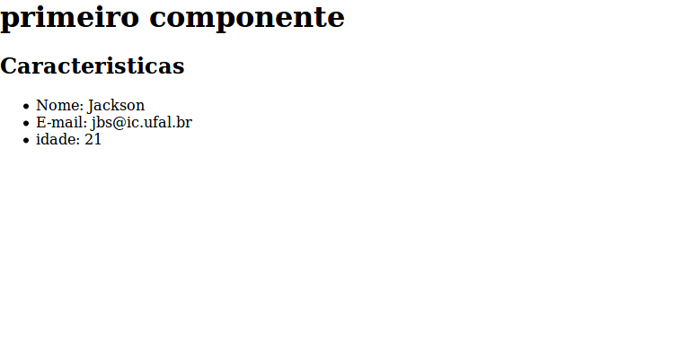

#Estudo de AngularJS

## Componentes
### Criar um componente
para criar um componente deve rodar o seguinte comando:
```sh
ng generate component <component_name>
```
Ou se preferir pode simplificar para:
```sh 
ng g c <component_name>
```
Fazendo isso você simplifica o comando utilizando as iniciais do que deseja.

Ao gerar o componente vão ser criados quatro arquivos, são eles:

  - <component_name>.component.css
  - <component_name>.component.html
  - <component_name>.component.spec.ts
  - <component_name>.component.ts
 
No arquivo **<component_name>.component.css** deve ficar toda a folha de estilo referente aos elementos deste componente.

No arquivo **<component_name>.component.html** deve ficar o HTML  que será mostrado ao usuário.

No arquivo **<component_name>.component.spec.ts** devem ficar os testes referentes ao componente.

No arquivo **<component_name>.component.ts** deve ficar os códigos referente ao comportamento, as caracteristicas e o estado do componente.

### Exemplo

Para criar uma página inicial sem um menu, fariamos o seguinte passo a passo:

1. Criar o componente
```angular-cli
ng g c home
```
Feito isso, vá para o o arquivo **home.component.ts** e vamos adicionar as informações básicas a serem mostradas (as caracteristicas deste componente).

Inicialmente o arquivo deve vir coom algo parecido com o que está abaixo 
```ts 
import { Component, OnInit } from '@angular/core';

@Component({
  selector: 'app-home',
  templateUrl: './home.component.html',
  styleUrls: ['./home.component.css']
})
export class HomeComponent implements OnInit {

  constructor() { }

  ngOnInit() {
  }

}

``` 

Dentro do **Componente** é possivel observar a definição de algumas coisas, são elas:
1. selector: O seletor é o nome que você usará para invocar o componente em outros componentes, fazendo isso dentro do 
**<component_name>.component.html** do outro component, fazendo algo como:
```html
<app-home></app-home>
```
Fazendo isso você está adicionando ao componente atual o componente criado no seu **componente home**.

#### Definindo as caracteristicas do home
Para este exemplo vamos definir que os elementos a serem mostrados são: 
1. titulo
2. caracteristicas do usuário
  - nome
  - idade
  - email
Certo, vamos passar isso pro código, fazendo isso teremos algo como:

```ts 
import {Component, OnInit} from '@angular/core';

@Component({
  selector: 'app-home',
  templateUrl: './home.component.html',
  styleUrls: ['./home.component.css']
})
export class HomeComponent implements OnInit {
  title: string;
  name: string;
  email: string;
  idade: number;
  constructor() {
    this.title = "primeiro componente";
    this.name = 'Jackson';
    this.email = 'jbs@ic.ufal.br';
    this.idade = 21;
  }
  ngOnInit() {

  }

}
``` 

Agora vamos passar essas informações para o html, ficando assim:
```html
<div class="home">
    <h1>{{ title }}</h1>
    <h2>Caracteristicas</h2>
    <ul>
    <li>Nome: {{name}}</li>
    <li>E-mail: {{email}}</li>
    <li>idade: {{idade}}</li>
    </ul>
</div>
```
perceba que para acessar os atributos do componente utilizamos **{{ <nome_atributo> }}**, esta técnica é chamada de 
interpolação, ela permite que você faça uso das caracteristicas definidas no arquivo typescript e mostre esses valores 
no html. 

Feito isso, vá no **app.component.html** (pois ele será sempre o primeiro a ser renderizado na tela por padrão), apague o html que lá está e coloque uma tag com o seletor que foi definido no novo componente, no exemplo que estamos vendo, **app-home**, dessa forma, o arquivo **app.component.html** ficará mais ou menos assim:
```html
<app-home></app-home>
``` 

### como testar?
Para ver como está ficando sua aplicação vá no terminal, certifique-se que está na pasta do projeto e execute o seguinte comando:
```angularcli
ng serve
```
Com ele será emulado em usua máquina um servidor para que você possa acompanhar comoe está ficando o projeto, para acessar veja no terminal o _*url*_ disponibilizado, normalmente estará em **https://localhost:4200/** 

Se você fez tudo como foi descrito acima, você deve se deparar com algo assim:



